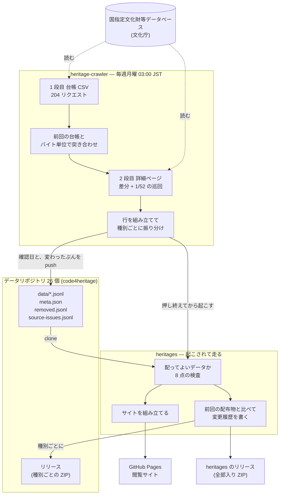

# データが流れる道すじ

文化庁のデータベースから、閲覧サイトと配布物に至るまでに、**3 つの持ち場**が関わる。
どれも独立したリポジトリで、互いを直接呼ばずに**リポジトリの中身と Actions の起動**で
繋がっている。この文書はその関係と、どこで何を確かめ、どこが更新されるかを 1 枚に
まとめたもの。個々の判断の根拠は `docs/decisions/` の ADR にある。

**分けている理由は 1 つ** — データを持つ場所とコードを持つ場所を混ぜない
([ADR 0001](decisions/0001-split-repositories-by-heritage-type.md) /
[ADR 0015](decisions/0015-single-cross-type-site-on-pages.md))。データは種別ごとに
分かれ、コードは種別を問わず 1 つで足りる。

## 登場人物

| 持ち場 | 何を持つ | 誰が書き込むか |
|---|---|---|
| **国指定文化財等データベース** (文化庁) | 原本 | — (**読むだけ**。1 req/s、User-Agent に連絡先) |
| **heritage-crawler** (このリポジトリ) | 取り出して組み立てるコード。**データは持たない** (`data/` は追跡外) | 人 |
| **データリポジトリ 26 個** (`code4heritage` org) | **データの正本**。JSON Lines・`meta.json`・`removed.jsonl`・種別ごとの ZIP | クローラー (中身) と heritages (リリース) の**両方** |
| **heritages** (`code4heritage/heritages`) | 閲覧サイトと配布物を作るコード。**データは持たない** | 人 |

データリポジトリ 26 個は分類コードと 1:1 ではない
([ADR 0009](decisions/0009-output-to-existing-per-type-repositories.md) /
[ADR 0012](decisions/0012-crawl-monuments-and-route-by-kind.md))。102 は詳細ページの
「国宝・重文区分」で 2 つに、401 は種別で 6 つに分かれ、複合指定は 2 つのリポジトリへ
同じ行が入る。対応表の正本は `src/heritage_crawler/catalog.py` の `TARGET_DATASETS`。

```
101 登録有形文化財      → registered-tangible-cultural-properties
102 国宝・重要文化財    → national-treasures / important-cultural-properties
103 重要伝統的建造物群  → important-preservation-districts-for-groups-of-traditional-buildings
401 史跡名勝天然記念物  → special-historic-sites / historic-sites
                          special-places-of-scenic-beauty / places-of-scenic-beauty
                          special-natural-monuments / natural-monuments
```

## 週次の一巡



時系列で追うと 1 巡はこうなる。押す前と配る前に関門があり、**通らなければ手前で
止まって、前回の状態が残る**。

| 時刻 (JST) | どこで | 何が起きるか |
|---|---|---|
| 月 03:00 | crawler | `weekly.yml` が起動。データリポジトリ 26 個を clone (= 前回の状態) し、前回の台帳を artifact から取り出す |
| | crawler | **1 段目**。分類 × 51 地域の CSV を取り直す (204 リクエスト)。1 地域取れなくても止めず、残りは `retry.sh` の次の回が試す ([ADR 0022](decisions/0022-keep-fetching-the-ledger-when-one-area-fails.md)) |
| | crawler | 前回の台帳と**バイト単位**で比べ、違ったファイルの行だけキーで突き合わせる。CSV が動いた週だけ `audit-listing --recover` を挟む |
| | crawler | **2 段目**。新規・値が変わったぶん・不具合の再確認 ([ADR 0030](decisions/0030-record-source-side-defects.md))・その週の 1/52 の巡回だけ詳細ページを取り直す。落とす候補は詳細ページで実在を確かめる ([ADR 0021](decisions/0021-record-removals-with-evidence.md)) |
| | crawler | 行を組み立て、**確認日 (`status.json`) と変わったぶん**を commit して push ([ADR 0023](decisions/0023-stamp-every-check-into-the-data-repositories.md))。中身が動かなかったリポジトリは「確認 (差分なし)」のコミットが 1 つ立つ |
| | crawler | heritages の `deliver.yml` を起こす。**確認日は渡さない** — サイトが `status.json` から読む ([ADR 0028](decisions/0028-read-the-checked-date-from-the-data.md)) |
| 月 03:20 頃 | heritages | 起こされて `deliver.yml` が走る。各データリポジトリを clone し、**配ってよいデータか確かめる**。通ったら配信と配布へ |
| | heritages | サイトを組み立てて Pages へ。前回の配布物と比べて変更履歴を書き、**行が動いた回だけ**リリースを立てる |
| 月 08:00 | heritages | **保険の cron。**起こされなかった週 (クローラーが転んだ・dispatch が届かなかった) はここで拾う |

## 誰が何を書き込むか

**同じデータリポジトリに 2 方向から書き込みが入る。**役割はきれいに分かれていて、
中身 (行と `meta.json`) はクローラー、リリース (ZIP) は heritages が受け持つ。

| 書き込む先 | 誰が | 何を | いつ |
|---|---|---|---|
| データリポジトリの `data/*.jsonl` | crawler | 都道府県ごとの行 | 行が動いた週 |
| データリポジトリの `meta.json` | crawler | 出典・**利用日**・表示名・語彙・件数 ([ADR 0014](decisions/0014-machine-readable-dataset-metadata.md)) | 同上 |
| データリポジトリの `removed.jsonl` | crawler | いま消えている指定 (状態型。復活すれば行が消える) | 落とした週 |
| データリポジトリの `source-issues.jsonl` | crawler | いまデータベース側の不具合で満足に取れていないもの (状態型。直れば行が消える。[ADR 0030](decisions/0030-record-source-side-defects.md)) | 不具合が現れた・消えた週 |
| データリポジトリの `status.json` | crawler | **確認日**・利用日・その週に行が動いたか・件数・実行の URL ([ADR 0023](decisions/0023-stamp-every-check-into-the-data-repositories.md)) | **毎週** |
| データリポジトリのリリース | **heritages** | 種別ごとの ZIP + 変更履歴 ([ADR 0019](decisions/0019-distribute-archives-through-releases.md)) | 行が動いた回 |
| heritages のリリース | heritages | 全部入り ZIP + `MANIFEST.json` | 同上 |
| heritages の Pages | heritages | 閲覧サイト | 走るたび |

**日付が 2 つあり、意味が違う。**混同すると「止まっているのに気付かない」か
「正常なのに警報が鳴る」のどちらかになる。

- **利用日** (`meta.json` の `accessed_date`) … そのデータを**取り出した**日。
  上流が変わらなければ古いままで、それが正常
- **確認日** (`status.json` の `checked_date`) … データベースを**見にいった**
  最後の日。クローラーしか知らないので毎週書く。**置き場は `status.json` 1 つ**で、
  サイトの「最終確認」もそこから読む ([ADR 0028](decisions/0028-read-the-checked-date-from-the-data.md))
  — データリポジトリを単独で受け取った人はサイトを見ないので、来歴はデータと
  一緒に旅する ([ADR 0023](decisions/0023-stamp-every-check-into-the-data-repositories.md))。
  サイトが採るのは**一番古い日**で、どれか 1 つへの push が落ちた週に
  「全部確かめた」と読めてしまわないようにしてある

## どこで何を確かめるか

関門は 3 つ。**上流に近いほど「取れているか」を、下流ほど「配ってよいか」を見る。**

### 1. 取得の最中 (crawler)

| 何を | どうやって | 通らないと |
|---|---|---|
| 相手がエラーページを返していないか | 本文の目印と大きさ (200 で返るため。[ADR 0011](decisions/0011-back-off-to-1-rps-and-detect-error-pages.md)) | キャッシュに残さず失敗として記録。連続で続けば打ち切る |
| 網羅性 | 全国件数と、CSV のキーの**異なり数**を比べる (件数表示どうしの引き算では相殺して見えない) | 報告に出る。網羅性が確かめられない分類では**消えた指定を落とさない** |
| どの地域でも引けない指定 | 検索結果一覧を全ページ辿って台帳と突き合わせる ([ADR 0017](decisions/0017-audit-completeness-with-the-search-listing.md)) | `--recover` で一覧から台帳へ回収する |
| 消えた指定が本当に消えたか | 詳細ページに問い合わせ、実在キーの**対照群**を前後に挟む ([ADR 0021](decisions/0021-record-removals-with-evidence.md)) | 確かめられなければ**落とさず翌週やり直す** |
| 想定外の項目 | 未知のラベル・読めない日付・CSV と食い違う名称を `BuildReport` へ | 実行のたび報告に出る (行は捨てない) |

### 2. 押す前後 (crawler の `weekly.yml`)

| 何を | 通らないと |
|---|---|
| 台帳を取り切れたか | 終了コード 1 で `retry.sh` が繰り返す。それでも駄目なら**押さずに終わる** (データリポジトリは前回のまま)。確認日も進まないので、**止まっていることがデータリポジトリ側から見える** ([ADR 0023](decisions/0023-stamp-every-check-into-the-data-repositories.md)) |
| 26 リポジトリへ押せたか | **1 つ押せなくても残りは押す** ([ADR 0029](decisions/0029-keep-pushing-when-one-repository-fails.md))。一時的に弾かれただけなら 3 回まで粘り、それでも駄目なら記録して次へ進む。1 つでも押せなければジョブは赤くなるが、**押せたぶんは押せたまま**。押せなかったリポジトリは確認日が古いまま残り、翌週の実行が同じ内容を押し直す |
| README の件数表がデータとずれていないか | **ジョブは失敗させず** Issue に残す (データの push は成功しているため)。`data` は追跡外なので、この検査はここでしかできない |
| サイトと配布物を起こせたか | **ジョブは失敗させず** Issue に残す。データの push は終わっており、配信は heritages の保険 cron が拾う (ただし確認日は渡らないので、サイトの「最終確認」は古いまま) |
| ジョブ全体 | 失敗したら Issue が立つ (同じ Issue が open なら追記)。本文は**全部押した / 一部だけ押せた / 押す前に落ちた**の 3 通りに書き分ける — データが更新済みかどうかが変わる |

### 3. 配る前 (heritages の `deliver.yml`)

`heritage-site build --check-only` が 8 点を見る (実装は heritages の
`heritage_site/checks.py`)。**1 つでも error なら配信も配布もしない** — 止めても
Pages は最後に成功したデプロイを配り続けるので、壊れたものが表に出ることはない。

| 何を | なぜ | 通らないと |
|---|---|---|
| `schema_version` | データ側が先に進んだら、読めないまま配らない | error |
| **確認日**が 45 日より古くないか | 古いのは「変わっていない」ではなく**確かめに行けていない** = 週次が止まっている | error |
| **利用日**が古くないか | 確認日が渡されないとき (手元での組み立て) だけの安全網 | error |
| `meta.json` の宣言と実ファイル | 宣言に無いファイルを配ると件数と中身がずれる | error |
| `meta.json` の件数と実際の行数 | 同上 | error |
| 索引に要る項目が揃っているか | 欠けると行を指す手段が無くなる | error |
| 複数のデータセットに現れる棟の一致 | 複合指定は同じ原本を指しているはず | error |
| 座標の欠けがどれだけあるか | **止める理由にしない** — 場所に結び付かない種別 (無形文化財・選定保存技術) と所有者が公開されていない行があり、欠け率は種別の性質。取得漏れは上の網羅性検査が名指しで捕まえる ([heritages #24](https://github.com/code4heritage/heritages/pull/24)) | 種別ごとの内訳を報告のみ |
| 日本の外周から外れた座標 | 元データの誤りとして地図から除く | **warning (止めない)** |

### 検査の置き場

外部サイトへ出る検査は**置かない**。相手先に不要な負荷をかけ、そのうえ不安定になる。

| 走るもの | いつ | 何を |
|---|---|---|
| `.github/workflows/ci.yml` | PR と push | ruff / mypy / pytest (doctest 込み) / `scripts/check-freshness.sh` / PR タイトル。Python 3.12・3.13・3.14 |
| `.github/workflows/freshness.yml` | 月次 | ドキュメントの参照ドリフト (Issue の状態はコミット無しに変わる) |
| `.github/workflows/reachability.yml` | 手で押したときだけ | 週次が使う 3 経路の疎通 (**唯一データベースへ出る検査**) |

## データが変わらない週に起きること

**動くのは確認日だけ**
([ADR 0023](decisions/0023-stamp-every-check-into-the-data-repositories.md))。

生成物が決定的なので、行が動かなければ `meta.json` も 1 バイトも変わらない。利用日は
「取り出した日」なので据え置かれ、heritages 側も変更履歴が空になってリリースを作らない。

各データリポジトリには `status.json` だけが動いた**「◯◯ に確認 (差分なし)」の
コミットが 1 つ**立つ。中身の変化だけを追うなら
`git log -- data meta.json removed.jsonl source-issues.jsonl` で絞れる。

**確かめ続けていることは 2 か所が示す。**データリポジトリの確認日と、サイトの
「最終確認」。どちらか一方でも古ければ、静かなのではなく取得できていない。

## 手で回す道

週次で回らないものが 2 つある。どちらもローカルで、Actions は差分専用
([ADR 0006](decisions/0006-run-initial-crawl-locally-updates-on-actions.md))。

- **初回の全件取得** — 4 分類 23,742 件を 2026-08-12、残る 15 分類 13,348 件を
  2026-08-23 に取得。計 37,090 件で完走済み (#74)
- **スキーマを変えたときの全件組み立て直し** (`build-records`) — キャッシュから
  作り直すので通信しない。**`removed.jsonl` は触らない** (キャッシュからは履歴を
  再現できず、書けば消える)

疎通だけを確かめたいときは、最も軽い 103 (126 件) で押せる。

```bash
gh workflow run reachability.yml
```
